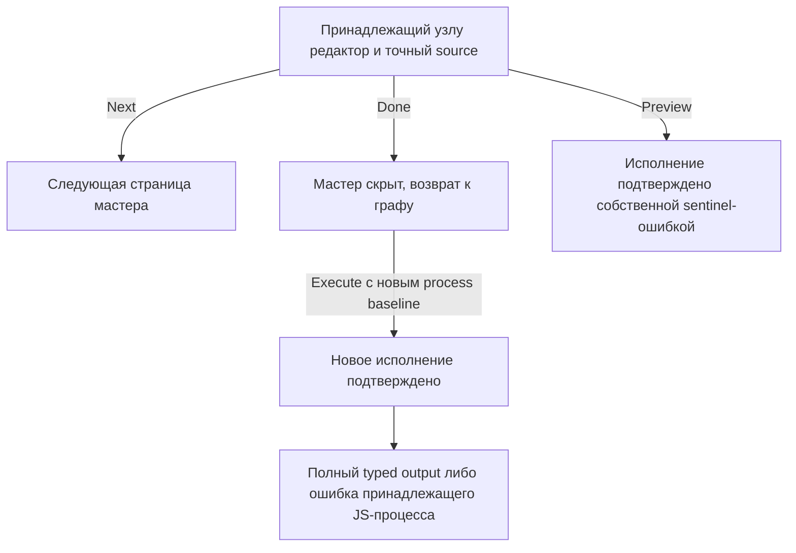

# JavaScript: наблюдённые переходы и эффекты

Состояние на 27 сентября 2026, Loginom Enterprise 7.4.2,
`http://logi-test-plan.bg.local/app/`. Оператор работает на Ubuntu в headed
Chromium. ОС сервера не установлена. Это сводка частичных доказательств G2/G3,
а не закрытие gates или готовность публичного обработчика.

## Переходы в двух режимах

В обоих режимах `code` и `declared` наблюдена следующая схема:

Стрелки Next и Done означают наблюдённый переход интерфейса. Их эффекты исполнения
**не установлены**. Нельзя считать эти переходы чистым чтением, доказанно
неисполняющими код или безопасными для автоматического повтора после потери ответа.
Успешный Done сам по себе не подтверждает свежесть выходной таблицы.

| Режим и действие | Наблюдение | Предел доказательства |
| --- | --- | --- |
| code / Preview | Собственная свежая sentinel-ошибка, batch41 | Исполнение подтверждено для пробы; общий batch имел неподтверждённый original cleanup |
| declared / Preview | Собственная свежая sentinel-ошибка, batch45 | Не означает проверку всех типов/асинхронных ошибок |
| code / Execute | Полный результат 6×2 в batch39; собственная failed child sentinel в batch50 | Подтверждены отдельные запуски, не все варианты JS |
| declared / Execute | Полный результат 6×2 и reopen source/mode/mappings в batch47; sentinel в batch50 | Reopen мастера не заменяет save/cold reopen пакета |
| code / Next | Переход наблюдён, sentinel отсутствует, batch52 | execution=ambiguous, gate=false |
| declared / Next | Переход наблюдён, sentinel отсутствует, batch52 | execution=ambiguous, gate=false |
| code / Done | Мастер скрыт, sentinel отсутствует, batch53 | execution=ambiguous; после закрытия outcome.owner_verified=false |
| declared / Done | Мастер скрыт, sentinel отсутствует, batch52 | execution=ambiguous; после закрытия outcome.owner_verified=false |

В исходнике клиента `JavaScriptCodeWizard.PageExitAsync` записывает код и вызывает
`VerifyAsync(() => FEngine.Verify())`. Это объясняет, почему отсутствие sentinel
не определяет серверные эффекты перехода: тело серверного Verify данной проверкой
не исследовано. Preview вызывает ActivateInputPorts и ShowPreview. Клиентский код
дополняет наблюдения, но не доказывает поведение невидимого серверного исполнения.

## Калибровка диагностики: K1 и K2

Source89 `ddc625cdd467da0b7665d72ffcf533c610987f4e`, тот же стенд7.4.2,
headed Chromium/Ubuntu. Отчёты и независимые проверки находятся в приватной
кампании `javascript-20260926-ubuntu`; исходные отчёты не переписывались.

| Проба | Наблюдённая граница | Диагностика и предел |
| --- | --- | --- |
| K1-parse-v1 / profile98 | Next остаётся в мастере и создаёт свежий native exception; отдельного Execute нет | Полный retained tree: `SyntaxError: Syntax error at code (:4:19)`, native class `EBGException`, stack пуст. Координаты сохранены внутри сообщения; server stack/source span не атрибутированы |
| K2-sync-v1 / profile97 | Done seal, одна reservation Execute, новый process/group и собственный failed child | Полный ErrorDetails: `Error: JS_CAL_K2_SYNC_V1`, caller `<main>:4:1`, module `<main>:1:1`; native INPUT4/upstream4 совпадают, OUTPUT не читается |

K1: exact274bytes/SHA721161cd4f4c0de387cefeef03b2425fd20f5645c05bff724103e330acd1620f,
500 проверенных journal references,4native INPUT cells. Result wizard_diagnostic_observed,
report UNRESOLVED: отмена не сопровождается независимым чтением prior committed
source и свежего upstream. Пакет закрыт/logout/browser closed подтверждены, но это
не подменяет доказательство rollback. Нельзя выводить отсутствие implicit execution
внутри Verify только из отсутствия отдельного Execute.

K2: exact291bytes/SHA3f7350f5f9e7cb30107fb314643ae844477a7b87610132036e995f556fe983c2,
604 проверенных journal references,8native cells. Report DIAGNOSTIC_OBSERVED;
исходный terminal exit1 отражает диагностический исход, не успешное вычисление.
Связь source/node/process и cleanup3 проверена; две позиции не устанавливают общую
карту Chakra/native-call offsets. Предшествующий K2/profile95 отказал до JS Execute
на origin ACK; его отдельный recovery не превращает тот отчёт в успешный.

Root audit receipts: `operator89-root-k1-verification.json` (PASS_WITH_GAPS) и
`operator89-root-k2-verification.json` (PASS в указанной узкой области).
Report SHA K1:a18d78cdb4a21ecd0fade200882e72ab846a0beefeb18fd3fa19472ec95bba53;
K2:9f64074a37207a12e3b56e60e29c55c2e099d6f6cf4422ed10846e39bf0bdc7c.
G6/J25 остаются открытыми: нужны repair того же узла, отмена/восстановление,
Stop/lost-reply и доставка модели. См. [допуск K3](calibration-source-proposal.md#9-допуск-реализации-k3-после-наблюдения-k2).

## Изменение schema при ручном сопоставлении

В batch54 впервые подтверждено сохранение ручных настроек: autosync=false,
ObservedID→ObservedID, PhaseMarker→ManualMarker, names/labels совпадают.
После изменения исходника PhaseMarker→GeneratedMarker и Done чтение source mapping
осталось неподтверждённым. Отдельного исполнения изменённого кода в batch54 не было.

В batch55 та же проба дополнена чтением сохранённого изменённого кода и отдельным
новым Execute. Журнал подтвердил ровно две фазы с разными source SHA и execution ID,
сохранность native identity прежнего процесса и принадлежность новой ошибки JS-узлу:

> Не удалось найти исходный столбец PhaseMarker для выходного столбца ManualMarker

Таким образом, эта несовместимая ручная связь не была автоматически успешно
переназначена. Это отрицательное наблюдение, а не требование добиваться успешного
автосброса mapping. Оно также не доказывает невозможность любого изменения schema.

После ошибки native reader показал полный inventory с пустым source_fields,
прежними targets ObservedID/ManualMarker, source:null и autosync=false.
`source_identity_verified=false`: новая GeneratedMarker schema и целостность связей
не подтверждены. Последующий private readiness timeout и неоднозначный scoped Close
не отменяют ранее подтверждённую ошибку исполнения. Original outer cleanup batch55
подтвердил закрытие пакета, logout и закрытие браузера.

В private отчёте batch55 есть дефект: summary trial остался pending_materialization,
хотя terminal записан в журнал. Поэтому вывод о новом исполнении основан на exact
events, отдельном boundary verifier и native ShowNode, а не на этой summary.
Исправление отчётности назначено; старые доказательства не переписываются.

## Источники и границы проверки

Приватный каталог кампании:
`~/.local/state/loginom-ai-agent/node-development/campaigns/javascript-20260926-ubuntu`.
Ни credentials, ни raw journals не публикуются в Git. Для каждого перечисленного
batch имеется отдельный `g2-batch-N-verification.json`; детали проверок и recovery
находятся в [checkpoint](checkpoint.md).

| Отчёт в каталоге кампании | SHA256 report.json |
| --- | --- |
| g2-batch-39 | 58b3e96e5f22c15fce7099d05073985c44e4be179eccf193b0f0b8e130383d33 |
| g2-batch-41 | 99ff0d2e1967d1680dcbb4214120b63347903e53a34aa38c6f862dd35dc979bb |
| g2-batch-45 | 9c94e415aba9c2fba2c41bcdd1f27cfc942e6aea7017861cfe9b8ce992615af7 |
| g2-batch-47 | cc1fa5635a990e969c2c3f98eb05d067a0f89fca80e1e4657b24266da1be947e |
| g2-batch-50 | 51bd3a1cbfd8b754eb77511660ac8560eea2d1aaa9ff27614c5173fe6e2484f4 |
| g2-batch-52 | 4ed8703042273beb46d21acaf636b8de068df729a1764e3623ae6725c150d5e1 |
| g2-batch-53 | 68b8352002569b8b0bdc4175378ac1928c84472957cbc51fdd84560ba9f00887 |
| g2-batch-55 | bc8f73b5096937905375c70fb5193ee4daae9df7cf5469ae3b266b33c868dd34 |

Клиентский `JavaScriptCodeWizard.js` сохранён в private preview-source-40,
SHA256 `ab0d3102321e00f38b5bd373c995bba67eb5beab1c10f1c349e8a7109b4362c7`.
Batch55 использует source commit `67628e1c82bc0ab58241acbd96e43db979f0634a`;
его независимый аудит подтвердил1574 journal refs,60 input cells,два исполнения,
один completed output6×2 и одну native failed child после ShowNode.

Открыты установление эффектов Next/Done, безопасная обработка несовместимой schema
в публичном контракте, другие строки G3 и проверки G5–G7. Успех отдельных наблюдений
не повышает готовность реестра и не заменяет автономную CLI-приёмку.

Профиль отдельных engine/type probes ведётся в [engine-profile.json](engine-profile.json).
Он отделён от G2-сводки и runtime knowledge manifest; непроверенные cases остаются
not_checked, а UI-proof не повышается до native byte roundtrip.
