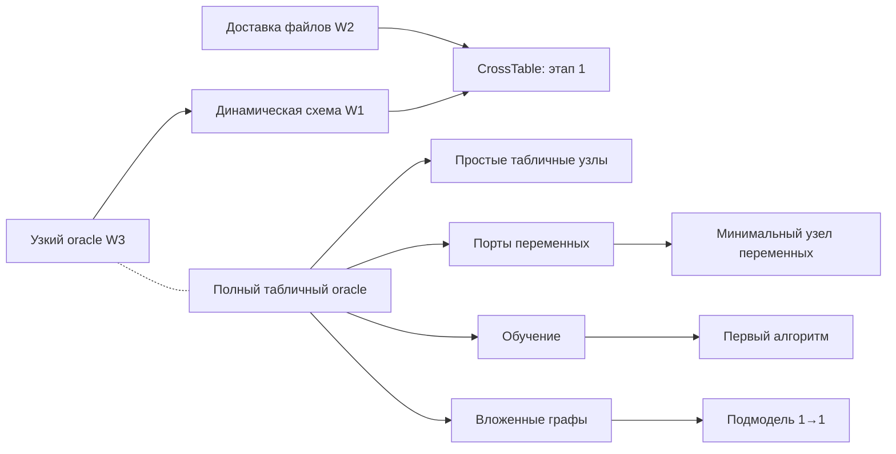

# Параллельная обработка подпланов в Multica

Снимок 2026-10-02. При подготовке этого регламента настройки Multica не применялись, новые карточки не создавались, нагрузочный прогон не выполнялся. По последующему сообщению владельца CrossTable и JavaScript уже разрабатываются; их существующие назначения сохраняются. После `git fetch origin cross-table` локальный HEAD и удалённая ветка совпали: `5f772aea9de6414a19feb6ecc109a196c9e92453`. Подпланы полного покрытия пока находятся в рабочем дереве; перед передачей этих изменений владелец публикует их и Генератор фиксирует актуальный SHA, не сбрасывая текущую работу исполнителей. Не отправлять исполнителям ссылки на отсутствующие в опубликованной ветке документы.

[Карта параллельности](../parallel-execution.json) дополняет [карту требований](../coverage-map.json), не заменяя её зависимости или [готовность узлов](../registry.json). Все 78 узлов и 213 этапов распределены по 13 предметным дорожкам и одной дорожке общих возможностей. Дорожки — удобные очереди выбора работы, а не 14 обязательных исполнителей и не запрет параллельности внутри семейства.

## Что подтверждено исходниками

| Источник | Подтверждённый факт | Практическое следствие |
| --- | --- | --- |
| Multica `b2561aad61055dd9937fc08f6497846b1458d018`, [agentconfig](https://github.com/multica-ai/multica/blob/b2561aad61055dd9937fc08f6497846b1458d018/server/internal/agentconfig/concurrency.go#L5) | `max_concurrent_tasks` агента: 1–50, default 6 | Один Worker может вести разные карточки; клонировать проект/сквад ради этого не нужно |
| [Daemon](https://github.com/multica-ai/multica/blob/b2561aad61055dd9937fc08f6497846b1458d018/server/internal/daemon/config.go#L72), [claim](https://github.com/multica-ai/multica/blob/b2561aad61055dd9937fc08f6497846b1458d018/server/internal/service/task.go#L3508) | Default daemon cap 20 суммарно по его runtimes; учитываются `dispatched`, `running`, `waiting_local_directory` | Лимит агента и свободная ёмкость daemon проверяются отдельно. Несколько daemon не образуют общий лимит машины |
| [Native очередь](https://github.com/multica-ai/multica/blob/b2561aad61055dd9937fc08f6497846b1458d018/server/pkg/db/queries/agent.sql#L749) | Один активный запуск на пару issue/agent; разные агенты одной карточки могут запуститься одновременно | Передачу Worker→Reviewer надо завершать явно; нельзя полагаться на автоматическое исключение всей карточки |
| [Local execution](https://github.com/multica-ai/multica/blob/b2561aad61055dd9937fc08f6497846b1458d018/server/internal/daemon/local_directory.go#L106), [capability gate](https://github.com/multica-ai/multica/blob/b2561aad61055dd9937fc08f6497846b1458d018/server/internal/handler/project_resource.go#L151) | `local_directory` поддерживает `execution_mode=worktree` при `local-worktree-v1`; `in_place` ждёт mutex пути внутри daemon | Разные карточки получают native checkout. Один общий in-place каталог не даёт реальной параллельной разработки |
| Клиент `5f772aea9`, `packages/agent/src/cli/profile.ts`; runtime `bridge.mjs` / `node-operation-runner.mjs` | Один writer конкретного CLI-профиля; операции сериализуются внутри своего bridge/runner | Отдельный профиль, браузер и аккаунт каждой роли/карточки. Это не глобальный запрет нескольких клиентов на хосте |
| Обвязка `swarm@f55d1f4afb52ca3490d22d4858cd8b2bb76ebe91`, `ops/loginom-multica/scripts/linux.py`, `accept.py` | Старый кандидат удерживает `auth.json.lock` на модельном subprocess; cold oracle запускается без этого auth-lock | На текущей базе сериализуется модельная фаза общей credential. Подготовка, анализ, build и независимый oracle могут перекрываться |
| Та же обвязка: `scripts/common.py`, `scripts/provision-accounts.py`, `PARALLEL.md` | `.artifacts.lock` принадлежит checkout; `.accounts.lock` защищает одну карточку; shared OAuth подготовлен отдельно | Разные checkout не делят build lock. Генератор остаётся с cap 1. Возможность обвязки не доказывает её установку на рабочем runtime |

Это проверка исходников, а не текущей конфигурации сервера. Git-сохранение инструкций не обновляет уже загруженные инструкции агентов. Установленную версию, capabilities, effective limits и контрольные суммы инструкций проверяют чтением перед запуском.

## Рекомендуемые пределы

Профили ниже — предлагаемые пределы запусков ролей, а не число отдельных учётных записей агентов. Один и тот же Worker/Reviewer может обслуживать разные карточки. `card_wip` включает разработку, ожидание ресурса и ревью; это правило допуска Генератора, не новое поле API Multica.

| Профиль | Генератор | Worker | Reviewer | Ёмкость выделенного daemon | Активных карточек не больше | Модельных попыток суммарно |
| --- | ---: | ---: | ---: | ---: | ---: | ---: |
| `legacy-development` — текущая база | 1 | 4 | 2 | 7 | 6 | 1 на общую credential |
| `shared-oauth-pilot` — первый пилот | 1 | 2 | 2 | 5 | 2 | 2 после подготовки OAuth |
| `balanced` — основной режим | 1 | 4 | 2 | 7 | 6 | 2 после успешного пилота |
| `expanded` — при запасе ресурсов | 1 | 6 | 2 | 9 | 8 | 2; дальнейший рост требует отдельной проверки |

Если daemon обслуживает другие проекты, приведённые числа нельзя считать свободными слотами: учесть их фактические запуски либо выделить runtime. Для первого опыта на ограниченном хосте снизить Worker до 2. Увеличивать ёмкость последовательно: две карточки → четыре исполнителя → шесть исполнителей. Переход требует достаточной памяти, приемлемой задержки диска/браузера и отсутствия конфликтов профилей, токенов, пакетов и доказательств. Численные пороги ресурсов закрепляются для конкретного стенда, сейчас они не измерены.

Reviewer=2 даёт параллельное чтение кода/доказательств и независимые oracle. Это не разрешение четырёх модельных попыток от двух Worker и двух Reviewer: `model_slots` — общий предел этих ролей. По умолчанию разрешать не больше двух тяжёлых сборок и двух oracle одновременно на хост; при нехватке памяти — по одному. Эти дополнительные пределы также организационные и требуют фактического допуска ресурса до фазы.

В native конфигурации числу Worker/Reviewer соответствует `max_concurrent_tasks` соответствующего агента. Эффективный daemon cap задаётся `max_concurrent_tasks` / `MULTICA_DAEMON_MAX_CONCURRENT_TASKS` / флагом daemon с учётом приоритета настроек. Сохранять выбранные значения в приватной deployment-конфигурации обвязки; повторный `configure.py` не должен возвращать старые defaults. Не менять модели, лидера, MCP, ресурс проекта и другие настройки заодно с параллельностью. Подготовка/загрузка выполняется штатными средствами обвязки в окно без активных и ожидающих задач, с read-back API. Этот документ сам её не выполняет.

Режим `sequential` допускает только одну активную карточку и по одному запуску каждой фазы; `single` ограничивает работу явно назначенным узлом/этапом и не продолжает очередь. При переключении прекратить новые допуски, дождаться подтверждённого завершения текущих операций, затем изменить лимиты. Понижение настройки не является отменой уже запущенных задач.

## Два режима OAuth

В исследованной `cross-table` нет `shared-oauth-v1`. При общей авторизации одна модельная попытка может занимать до 7200 секунд, поэтому дополнительные Worker сначала ускоряют исследование, код, тесты и подготовку пакетов. Не выдавать ожидающий auth-lock процесс за полезную параллельную работу.

Поддержка опубликована отдельно в [`oauth-parallel@31dfc6412946b8d6042bab27f914aeeaf2e2b2e7`](https://github.com/gooddaytoday/loginom-ai-agent/tree/31dfc6412946b8d6042bab27f914aeeaf2e2b2e7). Перенос и интеграция этого изменения — отдельная работа владельца клиентской базы; планы не предполагают, что cherry-pick уже сделан. До `shared-oauth-pilot` обязательны:

1. Новый чистый опубликованный SHA каждой кандидатной ветки включает поддержку; проверенный manifest и `--capabilities` подтверждают `shared-oauth-v1`.
2. Установлена согласованная версия обвязки, проверен её `VERSION.json`; авторизация перенесена штатной процедурой `PARALLEL.md` в один приватный каталог с короткой блокировкой обновления.
3. Ветки пилота обе обновлены; старые долгие model runs завершены. Копирование refresh token в отдельные профили, удаление lock/pending-маркеров и параллельный вход старым клиентом не используются.
4. Проверены effective limits, отдельные профили и пары аккаунтов, одинаковый назначенный стенд, `loginom status=ready` и доступность памяти.

Результат пилота, необходимый для перехода к `balanced`: два реальных модельных прогона перекрылись по времени; оба пакета прошли независимую приёмку, сохранение/новое открытие и cleanup. Отсутствие OAuth-ошибки само по себе недостаточно. Это выходной критерий пилота, не условие, которое требуется выполнить до его первого запуска.

В этом режиме длинный ресурс `legacy-oauth` из карты не применяется; короткая межпроцессная блокировка чтения/обновления токена остаётся обязательной. Её реализует проверенный клиент, не Генератор. На разных хостах одноимённые lock-файлы не синхронизируются: требуется одна обслуживающая этот credential среда или действительно независимые авторизации. Нельзя масштабировать копированием одной пары токенов.

Срок 7200 секунд относится только к модельной попытке. Общий timeout запуска Multica должен включать исследование, build/tests, модель, oracle и cleanup. Default upstream idle watchdog 2 часа не является таким общим deadline; устанавливать whole-agent cap 2 часа по аналогии с модельной фазой нельзя.

## Дорожки разработки

Генератор выбирает доступный этап из любой дорожки, сверяя `hard_requires` с принятым scope, доказательствами и включённым dependency SHA. Приоритет и `recommended_after` помогают выбрать, но не создают зависимость. Подготовку независимых входов, формул ожидаемого результата и исходных исследований можно вести заранее; реализация и приёмка потребителя не объявляются готовыми на непринятом общем контракте.

<!-- parallel-lanes:start -->

| Направление | Назначение | Подпланы узлов | Общие подпланы |
| --- | --- | --- | --- |
| Общие возможности runtime `F00` | Отдельные владельцы контрактов; независимые fixtures параллельны, одинаковые общие участки изменяются в согласованном окне. | — | [acceptance](../foundations/acceptance/plan.md) [typed-ports](../foundations/typed-ports/plan.md) [training](../foundations/training/plan.md) [nested-workflows](../foundations/nested-workflows/plan.md) [external-systems](../foundations/external-systems/plan.md) |
| Выражения и настройки строк `L01` | После oracle-tabular: отдельные s1 maintenance; затем date-time:s2, field-parameters:s2, calculator:s2. Остальные s2/s3 выбираются по собственным prerequisites. | [calculator](../nodes/calculator/plan.md) [field-parameters](../nodes/field-parameters/plan.md) [row-filter](../nodes/row-filter/plan.md) [sorting](../nodes/sorting/plan.md) [replacement](../nodes/replacement/plan.md) [duplicates](../nodes/duplicates/plan.md) [date-time](../nodes/date-time/plan.md) [missing-values](../nodes/missing-values/plan.md) | — |
| Табличные соединения и форма таблицы `L02` | После oracle-tabular: transform-enrichdata:s1, transform-slidingwindow:s1, transform-coluniondata:s1 либо один из s1 maintenance; далее join:s2/union:s2/grouping:s2 независимы между узлами. | [grouping](../nodes/grouping/plan.md) [join](../nodes/join/plan.md) [union](../nodes/union/plan.md) [collapse-columns](../nodes/collapse-columns/plan.md) [transform-coluniondata](../nodes/transform-coluniondata/plan.md) [transform-enrichdata](../nodes/transform-enrichdata/plan.md) [transform-slidingwindow](../nodes/transform-slidingwindow/plan.md) [transform-ungroupdata](../nodes/transform-ungroupdata/plan.md) | — |
| Кросс-таблица и её узкие общие изменения `L03` | CrossTable уже разрабатывается по сообщению владельца от 2026-10-02; сверить stage/SHA существующей карточки, не запускать повторно. Собственный владелец W1–W3; oracle-crosstable + W2/file-artifacts, затем dynamic-schema и transform-crosstable:s1. s2 ждёт полного oracle-tabular и variant-values, s3 — typed-variables. | [transform-crosstable](../nodes/transform-crosstable/plan.md) | [acceptance](../foundations/acceptance/plan.md) [dynamic-schema](../foundations/dynamic-schema/plan.md) [external-systems](../foundations/external-systems/plan.md) |
| Локальные файлы и форматы `L04` | После oracle-tabular + file-artifacts: imports-excel:s1 и imports-lgd:s1 независимо; текстовые s1 maintenance. Экспорт ждёт external-effects; LGD — проверенный независимый reader. | [text-import](../nodes/text-import/plan.md) [text-export](../nodes/text-export/plan.md) [exports-excel](../nodes/exports-excel/plan.md) [exports-lgd](../nodes/exports-lgd/plan.md) [imports-excel](../nodes/imports-excel/plan.md) [imports-lgd](../nodes/imports-lgd/plan.md) | — |
| Переменные `L05` | После typed-variables: любой s1. VarToData и DataToVar не являются предпосылками друг друга; fixtures портов подготовлены заранее. | [variables-calculator](../nodes/variables-calculator/plan.md) [variables-coluniondatavar](../nodes/variables-coluniondatavar/plan.md) [variables-datatovar](../nodes/variables-datatovar/plan.md) [variables-replace](../nodes/variables-replace/plan.md) [variables-vartodata](../nodes/variables-vartodata/plan.md) | — |
| Деревья `L06` | После typed-trees: DataToTree:s1, TreeToData:s1, JSONToTree:s1 и другие s1 независимы. Прямой prepared tree fixture исключает цепочку JSONToTree→все остальные→TreeToJSON. | [trees-calculatortree](../nodes/trees-calculatortree/plan.md) [trees-datatotree](../nodes/trees-datatotree/plan.md) [trees-jsontotree](../nodes/trees-jsontotree/plan.md) [trees-joindatatree](../nodes/trees-joindatatree/plan.md) [trees-treetodata](../nodes/trees-treetodata/plan.md) [trees-treetojson](../nodes/trees-treetojson/plan.md) [trees-uniontree](../nodes/trees-uniontree/plan.md) | — |
| Исследование и необучаемая предобработка `L07` | Quality:s1 допустим сразу как source discovery. После oracle-tabular: CorrAnalysis:s1, Sampling:s1, DataPartition:s1 и PCA:s1 независимы. Sampling recommended_after не блокирует DataPartition. | [preprocessing-datapartition](../nodes/preprocessing-datapartition/plan.md) [preprocessing-elimoutlier](../nodes/preprocessing-elimoutlier/plan.md) [preprocessing-sampling](../nodes/preprocessing-sampling/plan.md) [preprocessing-smoothing](../nodes/preprocessing-smoothing/plan.md) [research-autocorrelation](../nodes/research-autocorrelation/plan.md) [research-corranalysis](../nodes/research-corranalysis/plan.md) [research-factoranalysis](../nodes/research-factoranalysis/plan.md) [research-quality](../nodes/research-quality/plan.md) | — |
| Обучаемая предобработка и неконтролируемые модели `L08` | После training + oracle-tabular: Binning:s1, Clustering:s1, AssnRules:s1 или Clope:s1. Ни один из этих узлов не должен ждать другого; shared train lifecycle один. | [datamining-assnrules](../nodes/datamining-assnrules/plan.md) [datamining-clope](../nodes/datamining-clope/plan.md) [datamining-clustering](../nodes/datamining-clustering/plan.md) [datamining-emclust](../nodes/datamining-emclust/plan.md) [datamining-sonn](../nodes/datamining-sonn/plan.md) [preprocessing-binning](../nodes/preprocessing-binning/plan.md) [preprocessing-coarseclasses](../nodes/preprocessing-coarseclasses/plan.md) | — |
| Регрессии, нейросети и временной ряд `L09` | После training + typed-variables + oracle-tabular: LinRegression:s1 как простой пилот, но LogRegression/ARIMAX/Neural s1 могут начинаться независимо с готовыми train/holdout fixtures. | [datamining-arimax](../nodes/datamining-arimax/plan.md) [datamining-linregression](../nodes/datamining-linregression/plan.md) [datamining-logregression](../nodes/datamining-logregression/plan.md) [datamining-neuralnetclass](../nodes/datamining-neuralnetclass/plan.md) [datamining-neuralnetreg](../nodes/datamining-neuralnetreg/plan.md) | — |
| Вложенные сценарии и управление `L10` | ReferenceNode:s1 ждёт только oracle-tabular. SuperNode:s1 — минимальный nested 1→1. Condition:s1 — control-flow. ExecNode:s1 — derived-components. Loop:s1 — control-flow + derived-components. | [control-condition](../nodes/control-condition/plan.md) [control-execnode](../nodes/control-execnode/plan.md) [control-loop](../nodes/control-loop/plan.md) [control-referencenode](../nodes/control-referencenode/plan.md) [control-supernode](../nodes/control-supernode/plan.md) | — |
| Базы данных и Warehouse `L11` | После connections на конкретном принятом провайдере: imports-database:s1; экспорт/SqlScript дополнительно ждут external-effects, SqlScript — typed-variables. 1C и Warehouse имеют отдельные environment gates. | [exports-database](../nodes/exports-database/plan.md) [exports-warehouse](../nodes/exports-warehouse/plan.md) [imports-database](../nodes/imports-database/plan.md) [imports-onecrequest](../nodes/imports-onecrequest/plan.md) [imports-warehouse](../nodes/imports-warehouse/plan.md) [integration-sqlscript](../nodes/integration-sqlscript/plan.md) | — |
| XML и HTTP-сервисы `L12` | После connections для XSD/REST/SOAP и требуемых file/effects capabilities: независимые s1. REST не ждёт SOAP/XML, XML import не ждёт XML export. | [exports-xml](../nodes/exports-xml/plan.md) [imports-xml](../nodes/imports-xml/plan.md) [integration-datatoxml](../nodes/integration-datatoxml/plan.md) [integration-extractxml](../nodes/integration-extractxml/plan.md) [integration-restrequest](../nodes/integration-restrequest/plan.md) [integration-soaprequest](../nodes/integration-soaprequest/plan.md) | — |
| Серверный код, процессы и специальные источники `L13` | JavaScript уже разрабатывается по сообщению владельца от 2026-10-02; текущий stage и общие prerequisites сверить с существующей карточкой. JavaScript:s1 после programming; Python:s1 дополнительно typed-variables. ExecCmd после typed-variables + external-effects, Kafka после своего connection/effects, Tableau historical-only требует отдельного discovery среды. | [exports-kafka](../nodes/exports-kafka/plan.md) [exports-tableau](../nodes/exports-tableau/plan.md) [imports-kafka](../nodes/imports-kafka/plan.md) [integration-execcmd](../nodes/integration-execcmd/plan.md) [programming-javascript](../nodes/programming-javascript/plan.md) [programming-python](../nodes/programming-python/plan.md) | — |

<!-- parallel-lanes:end -->

Не вводить искусственные цепочки Import→Export, Sorting→ARIMAX, DataPartition→модели, JSONToTree→все деревья, полная SuperNode→всё управление. Для проверок использовать самостоятельные подготовленные источники. Внутри одного узла держать одного текущего владельца, даже если два поздних этапа являются соседними ветвями DAG: это предотвращает одновременную правку одного handler без вымышленного нового `hard_requires`.

## Продолжение с учётом уже начатых работ

CrossTable (`transform-crosstable`) и узел JavaScript (`programming-javascript`) уже находятся в разработке — источник: сообщение владельца от 2026-10-02. Это не сведения об активном режиме Калькулятора и не аналитический PASS этих узлов. ID карточек, фактические этапы, рабочие SHA и промежуточные результаты в этой подготовке не проверялись. Генератор сначала связывает план с существующими карточками и учитывает их в WIP; повторно назначать эти узлы или переносить их на новую базу автоматически нельзя.

| Работа | Что выполняется одновременно | Что остаётся последовательным |
| --- | --- | --- |
| CrossTable — существующая карточка | Продолжение назначенного scope и подготовка отрицательных проверок W1/W2/W3 | Сохранить текущего владельца. `crosstable-core` описывает этап 1; фактическое назначение сверить, не заменять его новой карточкой |
| JavaScript — существующая карточка | Продолжение своего узлового кода и fixtures в отдельном checkout | Сверить текущий stage и уже включённые общие изменения. Не создавать отдельно конкурирующий `foundation:programming` или oracle, если они входят в это назначение |
| Полный `foundation:oracle-tabular` — согласовать владельца | Независимые fixtures, expected, проверки порядка и Int64; дизайн совместимого расширения | Сначала проверить, что уже делает JavaScript и CrossTable W3. Новый исполнитель берёт только непокрытую часть по явной границе общих функций; без дублирования существующей работы |
| Следующее узловое направление — `research-corranalysis:s1` | Исследование и независимые математические ожидания, пока две текущие разработки продолжаются | Реализация/приёмка потребителя требует принятого `foundation:oracle-tabular` на используемом SHA; подготовка не означает закрытый prerequisite |
| Подготовка файловых форматов | Fixtures Excel/LGD/XML и независимые readers в отдельных файлах | Общая доставка W2 остаётся у CrossTable. Не создавать второй конкурирующий handler доставки |
| `research-quality:s1` | Исследование исторического component ID и источника семантики | Его последующий handler ждёт подтверждённого контракта; отсутствие среды не блокирует остальные дорожки |

Базовые две линии уже заняты CrossTable и JavaScript. Третью линию направить на подготовку Корреляционного анализа либо на явно незанятую часть полного oracle после сверки владельцев. Если oracle ещё не принят, это подготовительная работа, а не готовый к приёмке новый обработчик. Для OAuth-пилота нужны две уже подготовленные независимые приёмочные задачи на совместимых кандидатах, а не просто две активные карточки. Если общий файл занят, работать над независимыми fixtures/модулями, затем завершить свой запуск с условием продолжения; не держать пустой agent run в цикле ожидания.

При сверке JavaScript проверить, входят ли в фактический scope общий редактор (`foundation:programming`) и полный табличный oracle, а для поздних этапов — порты переменных, динамическая policy, доставка модулей и внешние эффекты. До сверки это возможные пересечения, не объявленные готовыми capabilities и не новый расширенный scope. Особое окно согласования с CrossTable — общая оболочка/чтение динамической схемы, UI и регистрация; узловые файлы и независимые fixtures остаются параллельными.

W1–W3 сохраняют владельца исходной карточки CrossTable. В `crosstable-core` входят четыре существующих этапа карты: `foundation:oracle-crosstable`, `foundation:file-artifacts`, `foundation:dynamic-schema`, `transform-crosstable:s1`. Это одно составное назначение, а не четыре конкурирующие карточки. Внутренние контрольные точки принимаются по порядку зависимостей на конкретных коммитах; внешний потребитель использует результат только после независимого подтверждения и согласованного включения SHA в его базу. Допустима отдельная публикация промежуточного W3-коммита в той же карточке для решения владельца об интеграции. Его принятие не означает Done всей CrossTable и не разрешает самовольный merge.

После принятия полного tabular oracle одновременно открыть, например: простой табличный узел, переменные с минимальным потребителем, обучение с первым алгоритмом и nested с SuperNode:s1. Каждый foundation проходит собственную приёмку; внутри объединённого назначения сначала foundation, затем потребитель. Между training, typed-variables, nested и остальными соседними foundations нет барьера «завершить всю волну». Их конкретные общие участки кода резервируются по правилам ниже.

Фрагмент зависимостей ниже показывает ранние независимые ветви; пунктир — конфликт ресурса, не новый prerequisite:

## Короткие последовательные окна

`development_locks` в карте — перечень известных конфликтов общих участков. Это декларация для Генератора и исполнителей, не автоматически установленная блокировка Multica. Резервирование записывается в комментарии карточки: ресурс, конкретные файлы/функции, владелец, исходный SHA, контрольная точка освобождения. Единственный Генератор выдаёт такой допуск и проверяет его перед передачей работы. Для всей кампании должен быть один назначенный владелец этого решения; несколько лидеров не должны независимо резервировать один ресурс.

| Группа | Последовательное действие | Что может продолжаться параллельно |
| --- | --- | --- |
| Общий oracle | Изменение expected schema и общих функций verifier; W3 и полный oracle не пишут их одновременно | Fixtures, отрицательные подмены, самостоятельные readers |
| Tabular shell / schema policy | Изменение общих частей `calculator-node`, `node-read`, `table-output` | Узловые параметры, UI-readers вне этих функций, тестовые данные |
| Порты / граф / lifecycle | Согласование и изменение общих refs, wire-форм, train/control/recovery переходов | Отдельные обработчики после закрепления интерфейса и независимые observers |
| Доставка файлов | Исправление общей идентичности, размера, SHA и upload/download поведения | Parsers конкретных форматов и проверка файлов |
| Регистрация / готовность | Включение согласованных изменений `node-api/contracts/support`, registry и генерируемых карт | Разработка собственных модулей в native worktree |
| Базовая ветка | Интеграция одного одобренного результата, проверка актуального base | Разработка и ревью остальных карточек на явно закреплённых SHA |

Общие файлы могут встретиться и у этапа без заранее перечисленного development lock. Перед правкой Worker сверяет фактический diff с общими группами и получает допуск; отсутствие записи в карте не означает исключительное владение. После завершения конкретного изменения допуск освобождается с SHA и результатом проверки. Ресурс регистрации не удерживается весь срок разработки или ожидания ревью. Семантическое изменение контракта не маскировать под обычное добавление строки регистрации.

После интеграции соседнего результата проверить актуальность базы. Rebase/исправление меняют SHA: старые доказательства сохраняются как история, затронутые проверки повторяются, Reviewer получает новый точный candidate SHA. Во время независимого ревью этот кандидат не переписывается. Разработчик не переносит чужую незавершённую ветку в обход gate. Merge и выпуск — отдельная команда владельца.

## Профили, внешние системы и приёмка

- Каждая карточка имеет собственный native checkout, рабочую ветку, `.multica-node`, candidate/output, run directories и пару worker/reviewer аккаунтов. Имена пакетов, таблиц, Kafka topics/groups, HTTP fixture sessions и временных файлов включают identity карточки/попытки. Общая test database допустима только с независимыми объектами или единственным владельцем.
- Build и acceptance одного checkout защищены `.artifacts.lock`; пересборка того же candidate во время его проверки запрещена. Разные checkout могут собираться одновременно в пределах host budget.
- CLI-профиль имеет `.writer`; профиль прямого Node cold oracle — другой механизм, его нельзя считать защищённым этим CLI marker. Каждый browser profile и output имеет одного владельца. Worker и Reviewer не работают одновременно с одной ролью/пакетом при передаче.
- В старом OAuth-режиме одна модельная фаза на credential, но oracle предыдущей попытки может идти одновременно с моделью следующей карточки при независимых аккаунтах/профилях и допустимой нагрузке. Blanket «одна полная CLI-приёмка на host» не является ограничением Multica или действующей обвязки.
- Дети build/model/oracle остаются внутри активного запуска Multica до своего завершения: штатный GC не читает `.artifacts.lock`. Нельзя завершить foreground run, оставив background child и рассчитывая, что lock защитит checkout от GC.
- `AMBIGUOUS`, потеря ответа или pending refresh сохраняют владельца и исходную попытку до recovery. Возраст процесса, истечение срока резерва и освобождение agent slot не доказывают остановку сервера. Не запускать replacement attempt поверх неизвестного эффекта и не освобождать профиль удалением marker.

## Карточка и передача ролей

Использовать существующий проект и сквад, штатные mentions, статусы и очередь Multica. [Короткий шаблон карточки](../templates/multica-stage-card.md) содержит ветку, узел/общую возможность и точный stage scope. Генератор прикладывает закреплённые SHA, доказанные prerequisites, ограничения ресурсов и конфиги без секретов. Большие инструкции остаются в канонических документах и загруженных шаблонах ролей.

1. **Генератор (cap 1)** проверяет опубликованные документы, ветку задания, stage/bundle, WIP, отсутствие другой активной карточки того же узла, `hard_requires`, environment gates и конфликтующих владельцев. Готовит отдельную пару аккаунтов штатной обвязкой, проверяет состояние и передаёт Worker настоящий адресованный mention. Общая инфраструктурная карточка должна явно указывать путь `foundations/<slug>/plan.md`; шаблон Генератора обязан понимать этот вход до её запуска.
2. **Worker** выполняет разрешённый scope, собственные проверки и приёмку, публикует чистый SHA/PR и доказательства. При ожидании ресурса или обязательного решения оставляет конкретный blocker, владельца и trigger в карточке, завершает запуск. Не удерживает слот бесконечным polling. Обычная подготовка не меняет readiness.
3. **Reviewer** начинает после завершения Worker и освобождения его операций. Проверяет именно переданный SHA другим аккаунтом. Readiness требует независимого результата и проверенных вложений/receipt digest. FAIL возвращает ту же карточку Worker с адресным дефектом; второй отрицательный вердикт эскалируется Генератору по действующим инструкциям.
4. **Done** ставит Reviewer только для полного назначенного scope после подтверждений. Для промежуточного foundation milestone публикуется отдельный вердикт и продолжение той же карточки; весь узел преждевременно не закрывается. Done, успешный run или принятый milestone не являются разрешением merge/release.

Native `blocks/blocked_by` удобно показывают связи, но в исследованном dispatch-коде не подтверждён запрет запуска по этим relations. Stage barrier также не заменяет нашу приёмку: `in_review` его не завершает, а `cancelled` может освободить. Комментарий/mention способен разбудить даже Backlog-карточку. Поэтому каждый участник повторно проверяет допуск до эффектов; статус или mention без scope/SHA/доказательств не даёт права обойти зависимости. Генератор допускает только готовую работу, используя штатную очередь, без дополнительного scheduler/базы leases/watchdog.

Основания на проверенном upstream SHA: [условие stage barrier](https://github.com/multica-ai/multica/blob/b2561aad61055dd9937fc08f6497846b1458d018/server/internal/service/issue_wakeup_condition.go#L407), [comment trigger](https://github.com/multica-ai/multica/blob/b2561aad61055dd9937fc08f6497846b1458d018/server/internal/service/issue_trigger.go#L78), [схема relations](https://github.com/multica-ai/multica/blob/b2561aad61055dd9937fc08f6497846b1458d018/server/migrations/001_init.up.sql#L88), [native wakeups](https://github.com/multica-ai/multica/blob/b2561aad61055dd9937fc08f6497846b1458d018/docs/engineering/issue-wakeups.md#L572). Инструкции сквада получает лидер; правила фаз должны быть загружены также Worker и Reviewer. Текст инструкции о запрете merge не является backend ACL: защиту ветки и доступы задаёт владелец Git-проекта.

Если очередь независимого ревью превысила два готовых кандидата или ресурс приёмки недоступен, прекратить новые реализации, завершать уже начатые и разбирать очередь проверок. Это предел незавершённой работы, а не повод пропускать Reviewer. После исправления blocker нужен один адресованный trigger продолжения той же карточки, без дублирующего назначения.

## Проверка и продолжение

Из корня проекта: `python3 docs/node-development/tools/validate.py --render`, затем та же команда без `--render`. Из `docs/node-development/tools`: `python3 -m unittest discover -s tests -p 'test_*.py'`. Инструменты проверяют полноту карты, ссылки, этапы, ресурсы и отображения; не назначают задачи и не подтверждают серверную параллельность.

Перед запуском владелец выбирает профиль, публикует документы, готовит capability/среду и загружает актуальные инструкции всем ролям с API read-back. Изменения хранятся здесь; загрузка в Multica, перенос OAuth, создание карточек, слияние и выпуск в эту подготовку планов не входили. Следующая точка продолжения — [checkpoint](../coverage-checkpoint.md).
