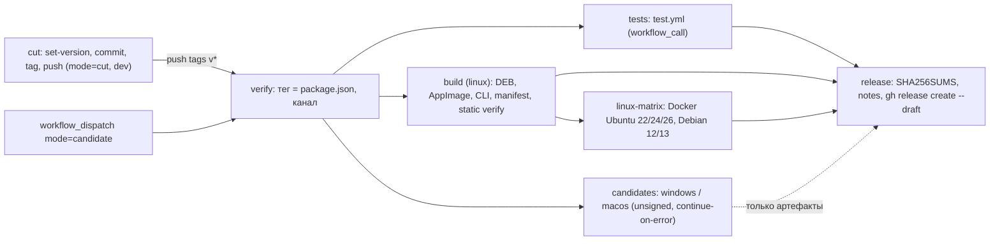

# CI: сборка релизов и прогон тестов в GitHub Actions

Workflow [release.yml](../../../.github/workflows/release.yml) собирает Desktop и самостоятельный CLI для Linux x64, Windows x64 и macOS arm64 на GitHub-hosted runners, прогоняет тесты, статическую проверку и Docker-матрицу Linux и создаёт **draft** GitHub Release с манифестами, отчётами и `SHA256SUMS.txt`. Workflow [test.yml](../../../.github/workflows/test.yml) запускает все тесты репозитория на Linux и одновременно служит релизным гейтом; [typecheck.yml](../../../.github/workflows/typecheck.yml) проверяет типы. Публикация draft — отдельное ручное действие, которое по политике репозитория требует явного разрешения; workflow никогда не публикует релиз сам.

Runners: `ubuntu-24.04`, `windows-2025`, `macos-15`. Совместимость с Ubuntu 22.04 и Debian 12 доказывает Docker-матрица, а не образ runner. Windows и macOS собираются как неподписанные candidate-джобы: их падение не блокирует Linux-релиз, а нативная приёмка по [Windows](windows.md) и [macOS](macos.md) остаётся `NOT_RUN`.

## Триггеры и режимы

| Запуск                                               | Что происходит                                                                                                                                                                                                                                                                                          |
| ---------------------------------------------------- | ------------------------------------------------------------------------------------------------------------------------------------------------------------------------------------------------------------------------------------------------------------------------------------------------------- |
| `push` тега `v*`                                     | `verify` сверяет тег с версиями в `package.json`; затем `tests`, `build`, `linux-matrix`, `release` (draft). Тег с pre-release суффиксом (`v0.2.0-beta.1`) даёт канал `beta` и `--prerelease`, иначе `prod`                                                                                             |
| `workflow_dispatch`, `mode=candidate` (по умолчанию) | Сборка и тесты указанного ref без релиза. Версия берётся из `packages/desktop/package.json`, канал — из input `channel` (`prod`/`beta`). Артефакты доступны 14 дней во вкладке run                                                                                                                      |
| `workflow_dispatch`, `mode=cut`                      | Только с `dev`: [script/set-version.ts](../../../script/set-version.ts) записывает версию, job коммитит `chore(release): vX.Y.Z`, ставит annotated-тег и пушит `HEAD:dev` вместе с тегом одним `--atomic` push. Push тега токеном GitHub App порождает событие `push tags`, и стартует сборочный прогон |

Inputs `bump` (`patch`/`minor`/`major`, относительно корневого `package.json`) и `version` (`X.Y.Z[-pre.N]`, приоритетнее `bump`) используются только в `cut`; `channel` — только в `candidate`.

Запуск с ветки до слияния в `dev`: вкладка Actions показывает лишь workflow из default branch, поэтому используется CLI по имени файла:

```sh
gh workflow run release.yml --ref <branch> -f mode=candidate
gh run list --workflow release.yml --branch <branch>
```

GitHub принимает такой dispatch только после того, как workflow с этим именем файла выполнился хотя бы раз (для `release.yml` это уже произошло в dry run ветки `ci-release`). Для совсем нового workflow без доступа к API остаётся временный `push: branches: [<ветка>]` триггер, который удаляется перед слиянием.

Альтернатива `cut` без GitHub App: закоммитить результат `bun script/set-version.ts --version X.Y.Z` в `dev`, затем `git tag -a vX.Y.Z -m vX.Y.Z && git push origin vX.Y.Z`. Сборочный путь одинаков.

## Граф jobs



`release` выполняется только для push тега и только при `success` у `verify`, `tests`, `build` и `linux-matrix`. Windows/macOS собираются отдельным job `candidates` с `continue-on-error` и пошаговыми таймаутами: его падение, зависание или отмена по таймауту не влияет на `build`, `linux-matrix` и `release` (в первом dry run зависший на 2 часа macOS-leg в общей матрице отменялся по таймауту и блокировал `linux-matrix`); отсутствующие ассеты помечаются в notes как `BLOCKED`.

## Что делает каждый job

- `cut` (`ubuntu-24.04`, `contents: write`): checkout с полной историей → [setup-bun](../../../.github/actions/setup-bun/action.yml) с `--frozen-lockfile` → [setup-git-committer](../../../.github/actions/setup-git-committer/action.yml) (токен GitHub App) → `bun script/set-version.ts --version|--bump` → `bun install --frozen-lockfile` → `git add package.json packages/desktop/package.json bun.lock` → commit, annotated tag, `git push --atomic --no-verify origin HEAD:dev refs/tags/vX.Y.Z`. Существующий локальный или удалённый тег останавливает job.
- `verify` (`ubuntu-24.04`): читает `.version` из `package.json` и `packages/desktop/package.json`. Для тега версия обязана совпасть с обоими файлами, иначе ошибка «commit script/set-version.ts output before tagging». Для candidate используется desktop-версия; расхождение с корнем даёт warning. Outputs `version`, `channel`, `prerelease` идут в остальные jobs как `LOGINOM_AI_AGENT_VERSION` и `LOGINOM_AI_AGENT_CHANNEL`.
- `tests`: `uses: ./.github/workflows/test.yml` с `secrets: inherit`; состав ниже.
- `build (linux)` (`ubuntu-24.04`, `timeout-minutes: 120`) и `candidates` (`build (windows)` на `windows-2025`, `build (macos)` на `macos-15`; `continue-on-error`, job 90 минут, шаги сборки 20–30 минут):
  1. Только Linux: `apt-get install libgtk-3-0t64 libnss3 libgbm1 libasound2t64 squashfs-tools` — Electron выполняется как Node внутри `write-manifest.ts`, `dpkg-deb`/`unsquashfs` нужны verifier'у.
  2. `setup-bun` (`--frozen-lockfile`) и [setup-loginom-inputs](../../../.github/actions/setup-loginom-inputs/action.yml). Composite читает `nodeVersion`, `chromiumRevision`, `playwright` из [loginom-release.json](../../../packages/product/loginom-release.json), скачивает официальную дистрибуцию Node с проверкой по `SHASUMS256.txt`, ставит Playwright Chromium через `npm ci` в `packages/loginom-runtime/client` и `playwright install chromium`, кэширует оба каталога в `$RUNNER_TEMP` и экспортирует `LOGINOM_AI_AGENT_NODE_SOURCE`, `LOGINOM_AI_AGENT_TEST_NODE`, `LOGINOM_AI_AGENT_BROWSER_SOURCE`, `PLAYWRIGHT_BROWSERS_PATH`. Единственная запись в дереве — gitignored `node_modules`.
  3. В `packages/desktop`: `bun run build` (с `NODE_OPTIONS=--max-old-space-size=6144`: electron-vite собирает весь backend в main-бандл, и стандартного heap V8 на macOS runner не хватает), `bun typecheck`, затем `bun run package:linux --x64 --publish never` в `build` либо `package:win --x64 --publish never` / `package:mac --arm64 --publish never` с `CSC_IDENTITY_AUTO_DISCOVERY=false` в `candidates`.
  4. `bun packages/loginom-host/script/build-cli.ts "$RUNNER_TEMP/cli/loginom-ai-agent-cli-<target>"` ([build-cli.ts](../../../packages/loginom-host/script/build-cli.ts)): рядом с payload появляются `loginom-ai-agent-cli-<version>-<platform>-<arch>.tar.gz` (Windows — `.zip`) и `.sha256`. Скрипт требует Bun ровно той версии и revision, что записаны в `packages/loginom-host/licenses/bun/source.json`.
  5. Только Linux: `node node_modules/electron/install.js` в `packages/desktop` (write-manifest.ts запускает `node_modules/electron/dist/electron` как Node, а `bun install` этот бинарник не оставляет), проверка `git status --porcelain` (дерево должно остаться чистым), `git archive` → `loginom-ai-agent-<version>-source.tar.gz`, [write-manifest.ts](../../../packages/desktop/scripts/release/write-manifest.ts) → `release-manifest.json` + `.sha256`, [verify-artifact.ts](../../../packages/desktop/scripts/release/verify-artifact.ts) для DEB (`static-deb.json`) и AppImage (`static-appimage.json`). Команды те же, что в [Linux-инструкции](linux.md).
  6. Файлы `packages/desktop/dist` (кроме `builder-*`) и CLI-архивы копируются плоско и выгружаются как artifact `loginom-<name>`, 14 дней.
- `linux-matrix` (`ubuntu-24.04`, после `build`): скачивает `loginom-linux`, снимает на runner ограничение `kernel.apparmor_restrict_unprivileged_userns` (Ubuntu 24.04 запрещает user namespaces процессам без AppArmor-профиля, а контейнеры матрицы работают с `apparmor=unconfined`; без этого zygote Chromium падает на `clone(CLONE_NEWUSER)`, sandbox браузера при этом остаётся включённым) и выполняет [run-matrix.ts](../../../packages/desktop/test/loginom/docker/run-matrix.ts) на DEB: Ubuntu 22.04/24.04/26.04, Debian 12/13, установка в чистую ОС, offline-запуск от UID 1200 с sandbox Chromium. Отчёт `linux-matrix.json` и логи — artifact `loginom-linux-matrix` (выгружается и при падении).
- `release` (`ubuntu-24.04`, `contents: write`, `GH_TOKEN: github.token`): скачивает все `loginom-*` в один каталог, удаляет `*.log`, запускает [script/release-notes.ts](../../../script/release-notes.ts) — считает SHA256 каждого файла, пишет `SHA256SUMS.txt`, формирует notes с таблицей ассетов и `git log` от предыдущего тега `v*`. Затем `gh release create <tag> --draft --verify-tag --title <tag> --notes-file notes.md [--prerelease] <assets>`. Ссылка на draft и notes попадают в step summary.

## Состав релиза и статусы

| Ассет                                                                                                                                                | Статус в notes                                                                                                                                               |
| ---------------------------------------------------------------------------------------------------------------------------------------------------- | ------------------------------------------------------------------------------------------------------------------------------------------------------------ |
| `loginom-ai-agent-linux-amd64.deb`, `loginom-ai-agent-linux-x86_64.AppImage`                                                                         | `static verify PASS + Docker matrix PASS (ubuntu22, …, debian13)` — проверенный Linux: статический verifier по manifest плюс Docker-матрица этого же прогона |
| `loginom-ai-agent-cli-<version>-linux-x64.tar.gz`, `.sha256`                                                                                         | `static verify PASS (cli-manifest)`; матрица покрывает только DEB                                                                                            |
| `release-manifest.json`, `release-manifest.json.sha256`, `static-deb.json`, `static-appimage.json`, `linux-matrix.json`                              | Linux release manifest (unsigned) и отчёты проверок                                                                                                          |
| `loginom-ai-agent-<version>-source.tar.gz`                                                                                                           | `git archive HEAD` проверенного commit                                                                                                                       |
| `loginom-ai-agent-win-x64.exe`, `.exe.blockmap`, `loginom-ai-agent-cli-<version>-win32-x64.zip`, `.sha256`                                           | `unsigned candidate; platformAcceptance=pending; native acceptance NOT_RUN`                                                                                  |
| `loginom-ai-agent-mac-arm64.dmg`, `loginom-ai-agent-mac-arm64.zip`, `.zip.blockmap`, `loginom-ai-agent-cli-<version>-darwin-arm64.tar.gz`, `.sha256` | то же: неподписанный candidate без нативной приёмки                                                                                                          |
| отсутствующий ожидаемый ассет                                                                                                                        | `BLOCKED: build job failed` — соответствующая джоба не выгрузила файл                                                                                        |
| `SHA256SUMS.txt`                                                                                                                                     | контрольные суммы всех файлов выше                                                                                                                           |

Release manifest генерируется только для `linux-x64`: схема [manifest.ts](../../../packages/desktop/scripts/release/manifest.ts) не описывает Windows/macOS, и их ассеты не проходят статический verifier. Файлы `latest*.yml` не создаются: feed обновлений в `Product.updateFeed` отключён, `publish` в electron-builder равен `null`.

## Переменные, секреты и подпись

- Только `cut`: `vars.LOGINOM_AI_AGENT_APP_ID` и `secrets.LOGINOM_AI_AGENT_APP_SECRET` — GitHub App с правом push в `dev` и создания тегов (тот же App, что в `generate.yml`). Все остальные jobs работают с `github.token`; базовые `permissions: contents: read`, `contents: write` только у `cut` и `release`.
- Подпись не настроена ни на одной платформе; артефакты помечены `unsigned`. Точки подключения:
  - Windows: [electron-builder.config.ts](../../../packages/desktop/electron-builder.config.ts) вызывает [script/sign-windows.ps1](../../../script/sign-windows.ps1) через `win.signtoolOptions.sign`. Скрипт подписывает только при `GITHUB_ACTIONS=true` и заданных `AZURE_TRUSTED_SIGNING_ENDPOINT`, `AZURE_TRUSTED_SIGNING_ACCOUNT_NAME`, `AZURE_TRUSTED_SIGNING_CERTIFICATE_PROFILE`; иначе печатает «Skipping Windows signing» и выходит с 0. Модуль `TrustedSigning 0.5.8` использует учётные данные Azure CLI, поэтому перед `package:win` нужен шаг `azure/login` (OIDC) и эти три значения в `env` шага. `verifyUpdateCodeSignature: true` уже включён.
  - macOS: шаг `Package desktop` job `candidates` задаёт `CSC_IDENTITY_AUTO_DISCOVERY=false`, electron-builder пропускает подпись и, как следствие, нотаризацию (`notarize: true`, hardened runtime и entitlements уже в конфигурации). Для включения убрать эту переменную и передать `CSC_LINK`/`CSC_KEY_PASSWORD` (Developer ID Application), а для нотаризации — `APPLE_ID`, `APPLE_APP_SPECIFIC_PASSWORD`, `APPLE_TEAM_ID` либо `APPLE_API_KEY`, `APPLE_API_KEY_ID`, `APPLE_API_ISSUER`.
  - Подписанные Windows/macOS сборки всё равно требуют нативной приёмки по своим runbook; подпись не переводит candidate в `PASS`.

## Публикация draft

1. Открыть draft по ссылке из step summary job `release` (или `gh release view vX.Y.Z --web`). Сверить таблицу ассетов с `SHA256SUMS.txt`, отчёты `static-*.json`, `linux-matrix.json` и при необходимости отредактировать notes.
2. Убедиться, что ассеты со статусом `BLOCKED` или `unsigned candidate` либо удалены из релиза, либо явно описаны как непригодные к распространению.
3. Публикация — отдельное явно разрешённое действие: кнопка «Publish release» в GitHub или `gh release edit vX.Y.Z --draft=false`. Workflow этого не делает. Feed автообновления остаётся отключённым, поэтому публикация не доставляет обновление установленным приложениям.

## Ограничения

- **Канал `beta`.** Pre-release тег даёт slug `loginom-ai-agent-beta`, а [Dockerfile](../../../packages/desktop/test/loginom/docker/Dockerfile) матрицы жёстко использует `/opt/loginom-ai-agent`. Поэтому `linux-matrix` для beta падает, `release` не создаётся; `verify` заранее печатает warning. Channel-aware матрица — отдельная задача.
- **Расхождение версий.** Корневой `package.json` — `0.1.0`, `packages/desktop/package.json` — `0.1.4`. `--bump patch` считается от корня и даст `0.1.1`, ниже уже выпущенной desktop-версии. Первый `cut` выполнять с явной версией, например `-f version=0.1.5`; после него обе версии совпадают и `bump` становится безопасным. Режим `candidate` собирает desktop-версию.
- **Повторный релиз тега.** Если для тега уже существует релиз или draft, `release` завершается ошибкой, а не создаёт дубликат. Удалить устаревший draft (`gh release delete vX.Y.Z`) и перезапустить job.
- **Windows/macOS hashes.** Хеши Node и Chromium для `win32-x64`/`darwin-arm64` берутся из [native-resource-candidates.ts](../../../packages/loginom-host/script/native-resource-candidates.ts). Несовпадение с официальными архивами даёт `LOGINOM_BUILD_INPUT_HASH_MISMATCH` в `stage-resources.ts`; джоба помечается failed, релиз Linux не блокируется, ассеты получают `BLOCKED`.
- **macOS `Build CLI`.** В dry run шаг `bun packages/loginom-host/script/build-cli.ts` на `macos-15` дважды прошёл за минуту, а затем дважды зависал без вывода; таймаут шага 20 минут превращает зависание в обычное падение candidate-leg (`BLOCKED` в notes). Причина не установлена; нативная отладка macOS — отдельная задача.
- **`draft-store.test.ts`.** `bun test` в `packages/desktop` исключает `src/main/draft-store.test.ts`: модуль импортирует `node:sqlite`, который есть в Node внутри Electron, но не в Bun 1.3.14. Тест остаётся для нативного запуска в Electron.
- **Только неподписанные сборки.** См. раздел выше; `cut` без настроенного GitHub App падает на шаге `Setup git committer`.
- Тесты и матрица не заменяют [нативную приёмку](README.md) установленного пакета; `PASS` в notes относится к перечисленным там проверкам.

## test.yml

Триггеры: push в `dev`, `pull_request`, `workflow_dispatch`, `workflow_call` (из `release.yml`). Все jobs на `ubuntu-24.04`, `permissions: contents: read`. Группа concurrency начинается с `tests-`, чтобы не отменять вызывающий `release-<ref>`.

| Job       | Команды                                                                                                                                                                                                                                                                                                                                                                                                                                                                                                                                                                                                                                                                                                                                                |
| --------- | ------------------------------------------------------------------------------------------------------------------------------------------------------------------------------------------------------------------------------------------------------------------------------------------------------------------------------------------------------------------------------------------------------------------------------------------------------------------------------------------------------------------------------------------------------------------------------------------------------------------------------------------------------------------------------------------------------------------------------------------------------ |
| `unit`    | `setup-bun`, `setup-loginom-inputs`, кэш Turbo; `GITHUB_ACTIONS=false bun turbo test --continue --log-order=stream --concurrency=2` — `test` пакетов, перечисленных в [turbo.json](../../../turbo.json) (agent, app, core, function, loginom-host, session-ui, ui; остальные пакеты turbo не запускает), включая `@loginom-ai-agent/loginom-host` с pinned Node через `LOGINOM_AI_AGENT_TEST_NODE` (`passThroughEnv`); `--continue` показывает все упавшие пакеты за один прогон (без него turbo 2.10 падал с SIGSEGV, останавливая остальные задачи), `--concurrency=2` не даёт subprocess-тестам agent с бюджетом 15–30 с голодать на 4-vCPU runner; затем `bun run check:generated` в `packages/client` и `bun run test:httpapi` в `packages/agent` |
| `desktop` | `bun test --path-ignore-patterns=src/main/draft-store.test.ts` в `packages/desktop` (у пакета нет script `test`, turbo его не запускает)                                                                                                                                                                                                                                                                                                                                                                                                                                                                                                                                                                                                               |
| `e2e`     | Node 24.15 (Playwright 1.59 зависает на распаковке Chromium с 24.16), Playwright из корневого catalog в отдельном `PLAYWRIGHT_BROWSERS_PATH`, `bun --cwd packages/app test:e2e:local`; `test-results` и `playwright-report` выгружаются как artifact `playwright-linux-<attempt>`                                                                                                                                                                                                                                                                                                                                                                                                                                                                      |

Локальное воспроизведение закреплённым toolchain (Bun 1.3.14; Node 24.19.0 и Chromium 1243 по [loginom-release.json](../../../packages/product/loginom-release.json), см. [Linux-инструкцию](linux.md)):

```sh
# packages/loginom-host — процессные тесты host требуют абсолютный путь к комплектному Node
LOGINOM_AI_AGENT_TEST_NODE=/absolute/cache/node-v24.19.0-linux-x64/bin/node bun test

# packages/desktop
bun test --path-ignore-patterns=src/main/draft-store.test.ts
bun typecheck

# корень репозитория — все test-скрипты workspace через turbo
LOGINOM_AI_AGENT_TEST_NODE=/absolute/cache/node-v24.19.0-linux-x64/bin/node bun turbo test --continue
```

Тесты `packages/loginom-host`, помеченные `native Windows`, на Linux пропускаются (`skip`), а не считаются пройденными. [typecheck.yml](../../../.github/workflows/typecheck.yml) запускает `bun typecheck` из корня на push в `dev` и pull request в `dev`; локально — `bun typecheck` из каталогов затронутых пакетов.
